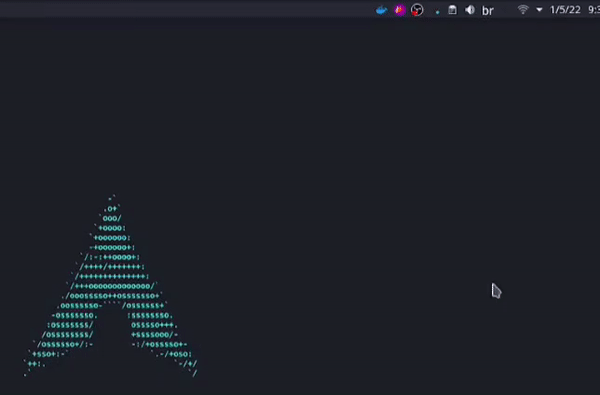

<div align="center">
  <h1>DockerTray Manager</h1>

</div>
This is a simples application built with electron as a study project. Here are the requirements to run this application:
- Have docker installed
- User need to have the rights to run docker commands without sudo

To use docker commands without sudo, you can add your user to docker group, just following this [example](https://docs.docker.com/engine/install/linux-postinstall/). or you can also try running everything with sudo.
## 📍 Important Note
This is my first electron application, so i did a lot of tests and decided to make babel configurantion by my self. So to run the script ```npm run dev```
you also need to run ```npm run start```, the first one run typescript compile, and the second run electron application. I know it's boring to run 2 scripts every time, so i'll fix that in soon.
## 👣 Steps to run
- Clone this repository
- Install the dependencies:
```bash
#with yarn
yarn install 

#with npm
npm install
```
- Now, to run delevopment server run:
```bash
#with yarn
yarn start 
# in other terminal
yarn dev
```
```bash
#with npm
npm run start
#in other terminal
npm run dev
```

## 🏗 Build time
The script build in package json will build just the package for linux system, but you can also change the script, or use other package to build, like electron forge.
```bash
#with yarn
yarn build

#with npm
npm run build
```


<p align="center">
So that's all folks, thanks for comming 🤖.
</p>
